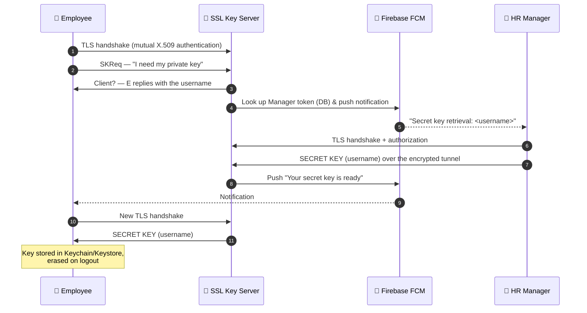

<div align="center">

# 🔐 UsersFlow — FHE-Based Secure Data Management System

### Securing enterprise user information with **Fully Homomorphic Encryption (FHE)** through a cross-platform mobile app

*Bachelor's Thesis · Universidad Politécnica de Madrid (ETSIT-UPM) · 2023*


**[📄 Read the full thesis (PDF)](https://github.com/user-attachments/files/26671130/FHE_TFG.pdf)** · **[✨ Features](#-features)** · **[🏗️ Architecture](#%EF%B8%8F-architecture)** · **[🚀 Getting started](#-getting-started)**

</div>

---

## 📖 Overview

Personal data stored in company databases is one of the most valuable — and most attacked — assets of any organization. Data leaks mean heavy fines (e.g. under Spain's **LOPD-GDD**), loss of trust and, in extreme cases, real-world harm. On top of that, today's classical public-key schemes such as RSA-2048 are expected to become obsolete once large-scale quantum computers arrive.

**UsersFlow** is a proof-of-concept **Human Resources management system** that demonstrates how **FHE** can answer both problems at once:

- 🧮 **Compute on encrypted data.** The server performs mathematical operations (e.g. worked-hours calculation) *without ever decrypting* the employees' data — it never sees the plaintext.
- 🛡️ **Post-quantum security.** FHE schemes are built on lattice cryptography, which is believed to resist quantum attacks.
- 👥 **A multi-user contribution.** FHE is naturally single-key. This project adds a **custom, authenticated key-exchange protocol over an SSL/TLS tunnel** so that an HR Manager can securely hand an employee their own private key — a practical answer to one of FHE's well-known limitations.

> All sensitive information leaving a mobile device is encrypted at all times and is decrypted **only at the endpoints**: the employees' phones and the HR Manager's phone.

---

## ✨ Features

| | Feature | Description |
|---|---|---|
| 📱 | **Cross-platform mobile app** | Built with Xamarin.Forms (C#), developed and tested on iOS; ~90 % shared code between platforms |
| 🔑 | **Role-based access** | `Manager` (HR) vs. `Developer` (employee) roles; unauthorized actions are denied |
| 🧾 | **FHE-encrypted profiles** | IBAN, national ID (DNI) and Social Security Number are stored encrypted (`cipherIban`, `cipherDNI`, `cipherSegSocial`) |
| ⏱️ | **Encrypted time tracking** | Entry/leave hours are encrypted on the phone; the server computes the **daily balance with a homomorphic subtraction** and stores the result encrypted |
| 🤝 | **Secure key sharing** | Custom protocol over a mutually-authenticated SSL/TLS tunnel with X.509 certificates |
| 🔔 | **Real-time authorization** | The Manager approves each key request through **Firebase Cloud Messaging (FCM)** push notifications |
| 🗄️ | **Hardware-backed key storage** | Keys live in the iOS **Keychain** / Android **Keystore** via Xamarin `SecureStorage` — and are wiped on logout |
| 🔒 | **Hardened credentials** | Passwords are salted and hashed with **Argon2** |
| ⚡ | **Parallel downloads** | Multi-threaded `Task` queues to cope with the large size of FHE ciphertexts |

---

## 🏗️ Architecture

The system is made of **three modules** deployed in a client–server architecture, with the two back-end services running as independent microservices on a remote virtual server (Ubuntu 20.04 on IONOS).

<div align="center">


*Global architecture: the REST API + MySQL database and the SSL key-exchange service run on a remote "homomorphic server"; employees and the HR Manager connect from their phones.*

</div>

| Module | Folder | Port | Responsibility |
|---|---|---|---|
| 📱 **UsersFlow client** | [`UsersFlowClient/`](UsersFlowClient) | – | Xamarin.Forms mobile app: login, profile, schedule registration, user management. Encrypts/decrypts with the user's private key. |
| 🌐 **REST API** | [`ApiRestUsersFlow/`](ApiRestUsersFlow) | `5025` (HTTP) | .NET Web API connected to MySQL. Stores encrypted data and runs the **homomorphic evaluator** (Microsoft SEAL) on ciphertexts. |
| 🔐 **Key exchange server** | [`KeyExchangeSSL/`](KeyExchangeSSL) | `10001` (TCP + SSL/TLS) | Multi-threaded TCP server implementing the custom key-exchange protocol and sending FCM notifications. |

<div align="center">


*REST API topology: the client talks HTTP to the API, which is the only component that touches the database.*

</div>

### Design decisions

- **Symmetric FHE encryption.** A single secret key per user keeps encryption fast and ciphertexts manageable; the multi-user key-distribution problem that comes with symmetric schemes is solved by the SSL key-exchange service.
- **Microsoft SEAL.** Chosen as the only FHE library with a mobile-friendly path (NuGet package for .NET / Xamarin on iOS & Android).
- **Relational database (MySQL).** FHE ciphertexts are *huge*; relational tables allow very large payloads and lightweight, split CRUD requests.
- **Client–server over layered/master–slave.** Better scalability and maintainability; MVC is applied inside each microservice.
- **Encrypt only what is sensitive.** Just three fields per employee are FHE-encrypted, as encrypting everything would make downloads prohibitively slow.

---

## 📲 The App

<div align="center">


*Login · Profile · Schedule registration · Schedule history · User management · Sign-up (all data shown is synthetic demo data).*

</div>

1. **Login** — session persistence; the role (`Manager` / `Developer`) defines what each user can do. The password hash is verified on-device with Argon2.
2. **Profile** — two swipeable cards: the **decrypted** data and the raw **encrypted** data as stored in the database. A Manager already holds every employee's key; an employee must first request theirs.
3. **Schedule registration** — the employee enters date, entry hour and leave hour. They are encrypted on the phone and the server returns the encrypted *worked hours* (`leave − entry`) computed homomorphically.
4. **User management** *(Manager only)* — download/decrypt all employee records, update, delete or create users (a fresh private key is generated and stored in the Manager's Secure Storage).

### Type conversions required by SEAL

Working with FHE from a high-level language is subtle, so entries go through a series of experimentally-validated conversions before and after encryption:

<div align="center">


</div>

---

## 🔑 Multi-user Key Exchange (the thesis' main contribution)

FHE ciphertexts can only be decrypted with the key that produced them. In UsersFlow the HR Manager's device holds every employee's private key, so an employee who wants to read their own record must obtain it **safely**.

<div align="center">


*Custom protocol for private-key exchange over SSL.*

</div>



**Security properties**

- ✅ **Mutual authentication** with self-signed X.509 certificates stored in both Trust Stores — mitigates *Man-in-the-Middle* attacks.
- ✅ **Manager consent** for every key release (a rejected request closes the tunnel).
- ✅ **The key only travels inside the encrypted tunnel** — the server acts as a relay between Manager and employee.
- ✅ **Key volatility:** keys are removed from the device on `logout`, so a shared phone can't leak another user's key.
- ✅ Concurrent clients are served on separate threads.

<details>
<summary><b>Trust Store &amp; SSL handshake diagrams</b></summary>

<div align="center">


</div>

</details>

---

## 🧠 Cryptography Background

<details>
<summary><b>Symmetric vs. asymmetric encryption</b></summary>

<div align="center">


</div>

Symmetric cryptography (AES, ChaCha20, Twofish…) is faster and needs less computation, which is why UsersFlow uses it. Asymmetric cryptography (RSA, Diffie-Hellman, DSA…) avoids sharing a private key but is significantly slower.

</details>

<details>
<summary><b>What is Homomorphic Encryption?</b></summary>

Homomorphic encryption (HE) lets you **compute on ciphertexts**; the result stays encrypted and can only be decrypted by the key owner.

| Type | What it supports |
|---|---|
| **Partially** homomorphic | Only certain operations (e.g. addition *or* multiplication) |
| **Somewhat** homomorphic | Limited number / depth of operations |
| **Fully** homomorphic (FHE) | Arbitrary computations of unbounded depth |

FHE originated with **Craig Gentry**'s first-generation scheme. Modern schemes are classified by computation model:

| Model | Schemes | Libraries |
|---|---|---|
| Boolean circuits | TFHE | TFHE, nuFHE, PALISADE |
| Modular arithmetic (integers) | BGV / BFV | HElib, **SEAL**, Lattigo, PALISADE |
| Floating-point (approximate) | CKKS | SEAL, Lattigo, PALISADE |

BGV/BFV security relies on **Ring-Learning-With-Errors (RLWE)**: noise is added to the plaintext during encryption and grows with homomorphic operations (additively for additions).

</details>

---

## 🧰 Tech Stack

| Layer | Technology |
|---|---|
| **Mobile client** | Xamarin.Forms (C# / XAML), Xamarin.iOS / Android, Xamarin.Essentials (`SecureStorage`), `Plugin.FirebasePushNotification`, `UserNotifications` |
| **FHE** | Microsoft SEAL (`Microsoft.Research.SEALNet` NuGet package) |
| **Back-end** | .NET 7 console/Web API, `MySql.Data.MySqlClient`, MVC + Repository pattern |
| **Key exchange** | TCP sockets, `System.Net.Security.SslStream`, X.509 certificates (OpenSSL) |
| **Database** | MySQL (XAMPP for visualization) |
| **Push notifications** | Firebase Cloud Messaging (FCM) / Apple APNs |
| **Password hashing** | Argon2 (with salt) |
| **Testing tools** | Postman, XAMPP, Visual Studio for Mac, Xcode simulator & physical iPhones |
| **Hosting** | IONOS virtual server · Ubuntu 20.04 · SSH |

<details>
<summary><b>Mobile platform internals</b></summary>

<div align="center">


</div>

- **Xamarin** shares ~90 % of the C# code across iOS and Android; native bits live in `Project.iOS` / `Project.Android`.
- Keys are kept in the **Keychain** (iOS) / **Keystore** (Android), protected by the secure co-processor, AES-GCM and Face ID / Touch ID.
- **FCM** delivers the push notifications that wake up the Manager's phone during the key exchange.

</details>

---

## 🗄️ Data Model

Two related tables (`Users` 1 — N `user_time`), with `ON DELETE CASCADE`:

```text
Users                                   user_time
─────────────────────────────           ─────────────────────────
_id (PK)                                _id (PK)
username, password (Argon2 hash)        user_id (FK → Users._id)
Name, Birth, Privilege                  date
DNI, SegSocialNumber, IBAN   (null)     entry_hour   ┐
cipherDNI, cipherSegSocial,             leave_hour   ├─ FHE ciphertexts
cipherIban                   (FHE)      balance      ┘  (homomorphic subtraction)
securityToken, token (FCM)              encParms     (encryption parameters)
encParms (encryption parameters)
```

> Plaintext counterparts of the encrypted columns are stored as `NULL`. Because ciphertexts are large, raise MySQL's packet limit:
> ```sql
> SET GLOBAL max_allowed_packet=2147483648;
> ```

---

## 🔌 REST API

Base route: `/api/user` (HTTP, port `5025`). Main operations described in the thesis (check `ApiRestUsersFlow/Controllers/UserController.cs` for the exact routes):

| Method | Endpoint | Purpose |
|---|---|---|
| `GET` | `/api/user/{username}` | Retrieve a user record (plaintext metadata + FHE-encrypted fields) |
| `GET` | `/api/user/all/usernames` | List all usernames *(Manager)* |
| `POST` | `/api/user` | Create a user with already-encrypted data → `201 Created` |
| `PUT` | `/api/user` | Update a user's (re-encrypted) record → `201 Created` |
| `DELETE` | `/api/user/{username}` | Delete a user → `204 No Content` |
| `PUT` | `/api/user/token` | Register / refresh the FCM device token |
| `POST` | `/api/user/schedule` | Store an encrypted time entry; the server computes the encrypted **balance** homomorphically |
| `GET` | `/api/user/schedule/getId/{id}` | Retrieve encrypted schedule entries |
| `DELETE` | `/api/user/schedule/{id}` | Delete a schedule entry |

<details>
<summary><b>Example: encrypted schedule inspected with Postman</b></summary>

<div align="center">


*The server only ever handles opaque Base64 ciphertexts (`entry_hour`, `leave_hour`, `balance`).*

</div>

</details>

All queries are **parameterized** (`command.Parameters`) to prevent SQL injection.

---

## 🚀 Getting Started

> ⚠️ This is a **research prototype**, not production software. Read the [limitations](#%EF%B8%8F-limitations) first.

### Prerequisites

- **.NET SDK 7.0** (SDK version must match the one supported by your Xamarin.iOS / Xcode Command Line Tools)
- **Visual Studio for Mac** (or equivalent) with Xamarin workloads
- **Xcode 14.3** and **iOS 16.4.1** (the versions the app was developed and tested with — Xcode and iOS versions must stay in sync)
- An **Apple Developer** account (provisioning certificate, ~€100/year) to debug on a physical iPhone
- **MySQL** (e.g. via XAMPP) and **OpenSSL**
- A Firebase project with FCM enabled (and APNs set up for iOS)
- **Microsoft SEAL** NuGet package — keep **the same version in every module**, a mismatch breaks all FHE functions

### 1. Database

```sql
CREATE DATABASE UsersInfo;
-- Create the `Users` and `user_time` tables (see the thesis, Figures 16–17)
SET GLOBAL max_allowed_packet=2147483648;
```

### 2. TLS certificates (self-signed X.509)

```bash
sudo apt-get install openssl
openssl genpkey -algorithm RSA -out private.key

openssl req -new -key private.key -out server.csr
openssl req -new -key private.key -out client.csr

openssl x509 -req -days 365 -in server.csr -signkey private.key -out server.crt
openssl x509 -req -days 365 -in client.csr -signkey private.key -out client.crt

# On the Ubuntu server: trust both certificates
sudo mv client.crt server.crt /usr/local/share/ca-certificates/
sudo update-ca-certificates
```

Generate the `.pfx` / `.p12` bundles for Xamarin/iOS, copy the certificates into both the key-exchange service and the mobile app, and **install them manually in the iPhone's Trust Store**.

### 3. Run the back-end services

```bash
# REST API (listens on :5025)
cd ApiRestUsersFlow
dotnet run

# SSL key-exchange server (listens on TCP :10001)
cd KeyExchangeSSL
dotnet run
```

Each module contains its own `README.md` with additional run instructions. Make sure ports **5025** and **10001** are open on your server firewall.

### 4. Run the mobile app

1. Open `UsersFlowClient` in Visual Studio.
2. Set the server IP/ports and certificates, and add your Firebase / APNs configuration.
3. Select a provisioned iPhone (or the Xcode simulator) and **Run / Debug**.

> 💡 To exercise the whole key-exchange flow you need **two devices** at the same time: one acting as *Manager*, one as *employee*.

---

## 🧪 Testing

- **Front-end:** Xcode iOS simulator, an iPhone 12 Pro Max and an iPhone X running Manager and employee roles in parallel; XAML *hot-reload*.
- **FHE demos:** small Xamarin apps (encrypted integer storage, a *homomorphic calculator* with the SEAL evaluator, and encrypted-zero experiments) to validate that decrypted results are correct.

<div align="center">


</div>

- **API:** Postman collections + XAMPP/phpMyAdmin to verify the persisted ciphertexts byte-for-byte (cipher parameters in the app and in the DB were compared to guarantee integrity).
- **Key exchange:** multi-client connections, certificate rejection tests, step-by-step logging of every protocol message and a byte-level comparison of the private key before/after transit.
- **Security review (CIA triad):**
  - **Confidentiality** — login + role-based authorization ✔️
  - **Integrity** — X.509-authenticated tunnel, Argon2-hashed passwords ✔️
  - **Availability** — *not fully implemented* (would require a firewall / DoS protection) ⚠️

---

## ⚠️ Limitations

- 🐢 **Latency & payload size.** FHE ciphertexts are big; a user record download is around **150–200 MB** for the encrypted fields. Parallel tasks mitigate it, but UX is far from perfect.
- 🧩 **Library interoperability.** The first prototype used Node.js + `node-seal`, but ciphertext headers/encryption parameters were incompatible with Microsoft SEAL for C#. Client and server must use **the same language/library**.
- 🐧 **SEAL on Ubuntu 20.04 + .NET** remained an open issue during development.
- 🗝️ **Key storage on the server.** Certificates are kept in a regular directory; a real deployment would need an HSM / secure vault.
- 🛡️ **Availability** was not fully addressed (firewall, DoS protection).
- 🔤 **Character-by-character encryption.** Text fields are encrypted per character as string arrays, so they can be stored but **not** used by FHE's analytical functions — only numeric fields (e.g. hours) can be computed on.
- 🧪 Scope is a prototype / demo, not a Minimum Viable Product.

---

## 🔭 Future Work

**On this project**

- 🪪 Encrypted company org-chart: job levels as encrypted numbers updated by homomorphic add/subtract.
- 🧱 Lightweight microservices in **Docker / Kubernetes** for the key exchange.
- 🔥 Firewalls, DoS protection, and stricter security policies (full *Availability*).
- 🔐 **2FA** and biometric/behavioral authentication; stronger key-exchange algorithms.
- 🧰 Hardware-based key custody (HSM) and hardware logic gates for encrypted comparison.
- ⚙️ Multi-threaded and updated SEAL builds to cut computation time.

**FHE research trends**

- Side-channel vulnerability studies of FHE libraries.
- Post-quantum protection of data *at rest* and *in transit* (FHE-encrypted WAN/LAN tunnels).
- Privacy-preserving **machine learning / neural networks** and **Big Data** analytics on encrypted data (e.g. pharma telemetry).
- Distributed storage for massive encrypted datasets.
- **FHE-based blockchains**, IoT / sensor security, and monetization of confidential data sets.

---

## ⚖️ Legal & Ethical Notes

The system is designed around Spain's **Organic Law 3/2018 (LOPD-GDD)** — notably the duty of confidentiality (Art. 5) and consent-based processing (Art. 6) — and aims to reduce the impact of intrusion offences such as Art. 197 bis of the Spanish Penal Code. Encrypting data at rest, in transit, *and* during computation limits what an attacker (or even the server operator) can learn.

---

## 🎓 About the Thesis

| | |
|---|---|
| **Title** | *Securización de la gestión de información empresarial del usuario utilizando cifrado completamente homomórfico (FHE), a través de una aplicación móvil multiplataforma* |
| **English title** | *Securing enterprise user information management using Fully Homomorphic Encryption (FHE) through a cross-platform mobile application* |
| **Degree** | Grado en Ingeniería de Tecnologías y Servicios de Telecomunicación |
| **University** | Universidad Politécnica de Madrid — ETSIT |
| **Author** | Raúl Giménez Lorente |
| **Advisor** | Diego Martín de Andrés |
| **Co-advisor** | Patricia Ortuño Otero |
| **Department** | Departamento de Ingeniería de Sistemas Telemáticos (DIT) |
| **Year** | 2023 |
| **Keywords** | LOPD-GDD · FHE · cross-platform mobile app · homomorphic server · key exchange · cryptography |

**Cite this work**

```bibtex
@thesis{gimenez2023fhe,
  author  = {Giménez Lorente, Raúl},
  title   = {Securización de la gestión de información empresarial del usuario
             utilizando cifrado completamente homomórfico (FHE),
             a través de una aplicación móvil multiplataforma},
  school  = {Universidad Politécnica de Madrid, ETSIT},
  year    = {2023},
  type    = {Bachelor's Thesis}
}
```

---

## 🙏 Acknowledgements

- [Microsoft SEAL](https://github.com/microsoft/SEAL) — the homomorphic encryption library powering the project.
- The FHE community on Discord for their help with SEAL-related questions.
- The cybersecurity company **IDBOTIC**, where the know-how behind this project was acquired.

<div align="center">

---

*If you find this project useful or interesting, consider leaving a ⭐*

</div>
